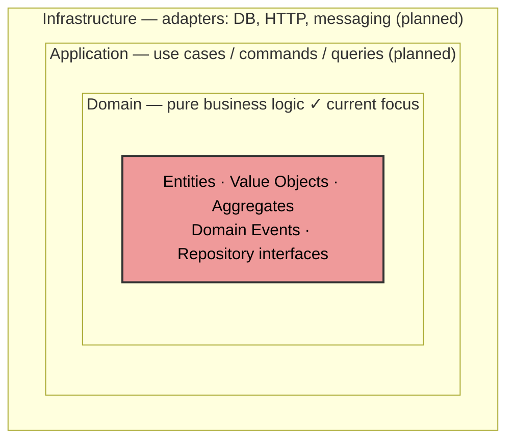
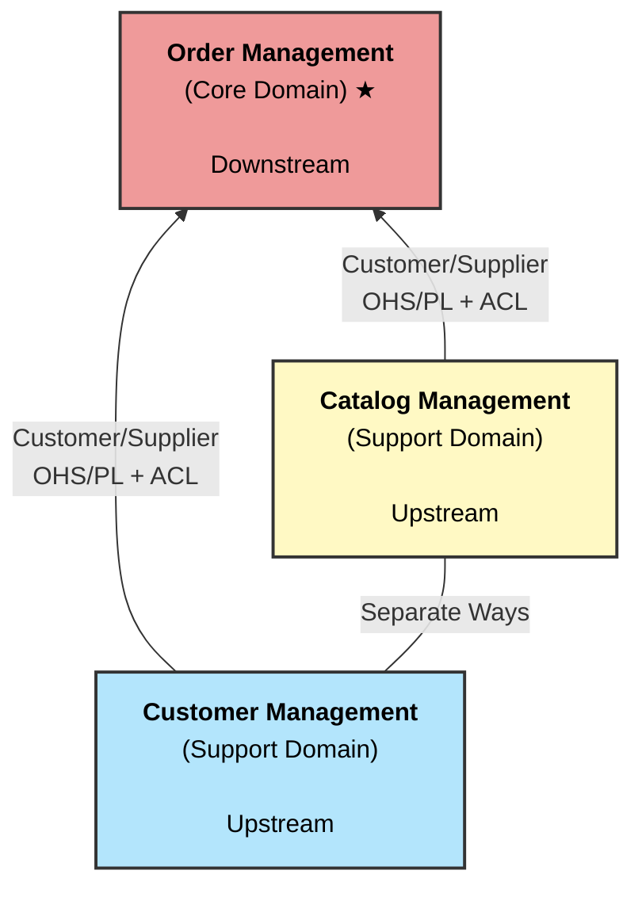
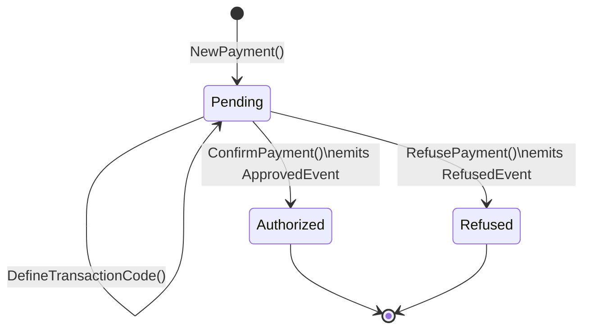

# Sales — DDD + Hexagonal Architecture Reference

> **Work in Progress** — This project is actively evolving. The domain layer is under construction; application and infrastructure layers are not yet implemented.

A reference implementation of **Domain-Driven Design (DDD)** tactical patterns combined with **Hexagonal Architecture (Ports & Adapters)** in Go. The focus is on demonstrating a rich domain model — not building a production-ready sales system.

---

## Overview

| | |
|---|---|
| **Language** | Go 1.25 |
| **Module** | `github.com/marcosvieirajr/sales` |
| **Core Domain** | Order Management |
| **Architecture** | DDD + Hexagonal (Ports & Adapters) |

---

## Architecture

This project follows Hexagonal Architecture, organizing code in concentric layers:



- **Domain layer** — zero external dependencies; all business invariants live here
- **Application layer** — orchestrates use cases; coordinates domain objects _(planned)_
- **Infrastructure layer** — repository implementations, HTTP handlers, messaging _(planned)_

See [`docs/ddd-rules.md`](docs/ddd-rules.md) for the DDD concepts and rules applied throughout this project.

---

## Bounded Contexts



Context relationships: Order Management is **downstream** (Customer-Supplier + ACL) from both Catalog and Customer contexts. Catalog and Customer are **Separate Ways** — no direct dependency between them.

---

## Domain Package Structure

```
domain/
│
├── errs/
│   └── errors.go              — DomainError with typed ErrorCode (AGGREGATE.REASON)
│
├── types/
│   ├── sex.go                 — Sex enum (NotInformed, Male, Female, Other)
│   └── status_marital.go      — MaritalStatus enum
│
├── utils.go                   — Must[T]() generic helper; GenerateID() stub
├── validations.go             — Guard functions used across all entities:
│                                CheckNotNullOrWhiteSpace, CheckNotZeroOrNegative,
│                                CheckMatchRegex, CheckNotNil, CheckNil
│
└── order/                     — Order Management bounded context
    │
    ├── order.go               — Order aggregate root [WIP]
    ├── order_status.go        — OrderStatus enum: Created → Paid → Separating → Shipped → Delivered | Cancelled
    ├── delivery_address.go    — DeliveryAddress value object (immutable, Brazilian CEP format)
    │
    ├── orderitem/
    │   └── order_item.go      — OrderItem entity (child of Order aggregate)
    │                            Fields: ProductID, ProductName, UnitPrice, Quantity, DiscountApplied, TotalPrice
    │                            Methods: NewOrderItem, ApplyDiscount, AddUnits, RemoveUnits, UpdateUnitPrice
    │
    └── payment/
        ├── payment.go                  — Payment entity with state machine
        │                                 State: Pending → Authorized | Refused
        │                                 Must call DefineTransactionCode before confirming/refusing
        ├── payment_method.go           — PaymentMethod enum: CreditCard, DebitCard, Cash, Pix, BankTransfer, BancSlip
        ├── payment_status.go           — PaymentStatus enum: Pending, Authorized, Refused, Refunded, Cancelled
        ├── payment_approved_event.go   — ApprovedEvent domain event
        └── payment_refused_event.go    — RefusedEvent domain event + base Event struct
```

---

## Key Patterns Implemented

### Error Handling
Typed sentinel errors using `DomainError` with `ErrorCode` following the `AGGREGATE.REASON` convention:

```go
var ErrInvalidProductID = errs.New("ORDER_ITEM.INVALID_PRODUCT_ID", "product ID cannot be null or whitespace")

// Multiple validation failures collected:
return errors.Join(
    domain.CheckNotNullOrWhiteSpace(productID, ErrInvalidProductID),
    domain.CheckNotZeroOrNegative(unitPrice, ErrInvalidUnitPrice),
)

// Test with errors.Is (compares by ErrorCode, not pointer):
assert.ErrorIs(t, err, orderitem.ErrInvalidProductID)
```

### Value Objects
Immutable structs with unexported fields; created via `New{TypeName}` factory; equality via `Equals()`:

```go
addr, err := order.NewDeliveryAddress(cep, street, number, complement, district, city, state, country)
addr.Equals(other) // compares all fields
```

### Entities
Mutable with exported fields; identity equality via ID; `TotalPrice` always derived; `UpdatedAt` set on first mutation:

```go
item, err := orderitem.NewOrderItem(productID, productName, unitPrice, quantity)
item.ApplyDiscount(10.0)  // recalculates TotalPrice, sets UpdatedAt
```

### Payment State Machine



### Domain Events
Emitted on significant state transitions; named in past tense:

```go
type ApprovedEvent struct {
    Event                     // OccurredAt() time.Time
    PaymentID, OrderID string
    Amount          float64
    TransactionCode *string
}
```

---

## Getting Started

```bash
# Run all tests
go test ./...

# Run tests with verbose output
go test -v ./...

# Run tests for a specific package
go test ./domain/order/orderitem/...
go test ./domain/order/payment/...

# Run a single test by name
go test ./domain/order/payment/... -run TestPayment_ConfirmPayment

# Build
go build ./...

# Lint
go vet ./...
```

---

## Roadmap

- [x] Domain — `errs`: DomainError with typed ErrorCode
- [x] Domain — `validations`: reusable guard functions
- [x] Domain — `DeliveryAddress`: value object with CEP validation
- [x] Domain — `OrderItem`: entity with invariants and TotalPrice recalculation
- [x] Domain — `Payment`: entity with state machine and domain events
- [ ] Domain — `Order`: aggregate root (in progress)
- [ ] Application — use cases / commands / queries
- [ ] Infrastructure — repository implementations (in-memory / database)
- [ ] Entry points — HTTP or gRPC handlers

---

## DDD Reference

Full DDD rules, pattern definitions, and architectural decisions applied in this project:

**[docs/ddd-rules.md](docs/ddd-rules.md)**

---

## Dependencies

| Package | Purpose |
|---|---|
| `github.com/stretchr/testify` | Test assertions (`assert`, `require`) |
| `github.com/google/go-cmp` | Struct comparison with `cmpopts.IgnoreFields` |
