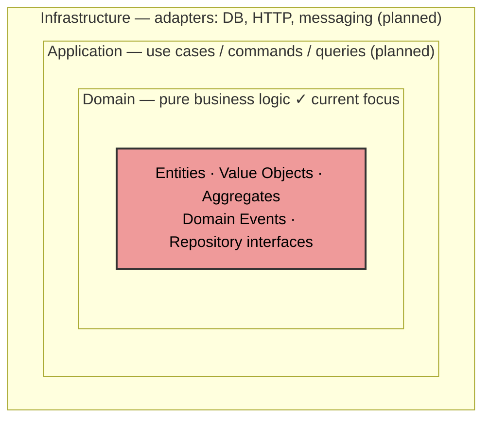
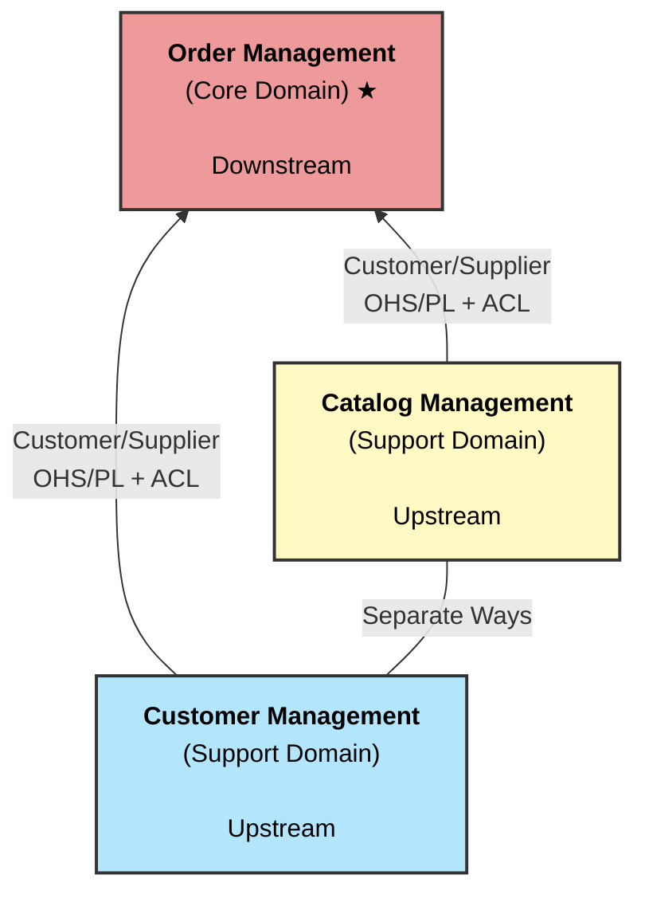
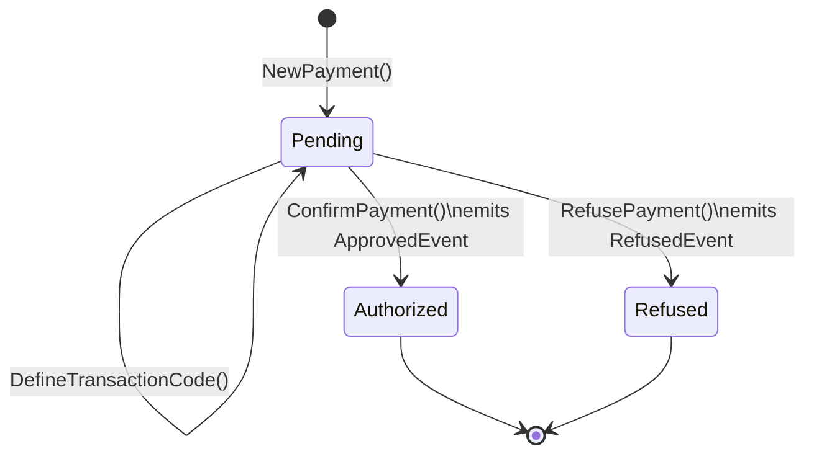

# Sales — DDD + Hexagonal Architecture Reference

> **Work in Progress** — This project is actively evolving. The domain layer is under construction; application and infrastructure layers are not yet implemented.

A reference implementation of **Domain-Driven Design (DDD)** tactical patterns combined with **Hexagonal Architecture (Ports & Adapters)** in Go. The focus is on demonstrating a rich domain model — not building a production-ready sales system.

---

## Overview

| |                                      |
|---|--------------------------------------|
| **Language** | Go 1.26                              |
| **Workspace** | Go Workspace (`go.work`) — 6 modules |
| **Core Domain** | Order Management                     |
| **Architecture** | DDD + Hexagonal (Ports & Adapters)   |

---

## Architecture

This project follows Hexagonal Architecture, organizing code in concentric layers:


```mermaid
graph TD
    subgraph infra["Infrastructure — adapters: DB, HTTP, messaging (planned)"]
        subgraph app["Application — use cases / commands / queries (planned)"]
            subgraph domain["Domain — pure business logic ✓ current focus"]
                D["Entities · Value Objects · Aggregates<br/>Domain Events · Repository interfaces"]
            end
        end
    end
    style D fill:#ef9a9a,stroke:#333,stroke-width:2px,color:#000
```

- **Domain layer** — zero external dependencies; all business invariants live here
- **Application layer** — orchestrates use cases; coordinates domain objects _(planned)_
- **Infrastructure layer** — repository implementations, HTTP handlers, messaging _(planned)_

See [`docs/ddd-rules.md`](docs/ddd-rules.md) for the DDD concepts and rules applied throughout this project.

---

## Bounded Contexts


```mermaid
graph BT
    OM["<b>Order Management</b><br/>(Core Domain) ★<br/><br/>Downstream"]
    CU["<b>Customer Management</b><br/>(Support Domain)<br/><br/>Upstream"]
    CM["<b>Catalog Management</b><br/>(Support Domain)<br/><br/>Upstream"]
    CU -->|"Customer/Supplier<br/>OHS/PL + ACL"| OM
    CM -->|"Customer/Supplier<br/>OHS/PL + ACL"| OM
    CU ---|"Separate Ways"| CM
    style OM fill:#ef9a9a,stroke:#333,stroke-width:2px,color:#000
    style CU fill:#b3e5fc,stroke:#333,stroke-width:2px,color:#000
    style CM fill:#fff9c4,stroke:#333,stroke-width:2px,color:#000
```

Context relationships: Order Management is **downstream** (Customer-Supplier + ACL) from both Catalog and Customer contexts. Catalog and Customer are **Separate Ways** — no direct dependency between them.

Additional modules — `inventory/` (Inventory BC) and `notification/` (Notification BC) — exist as scaffold placeholders and are not yet integrated into the context map.

---

## Repository Structure

```
go.work                             — workspace: kernel, order, customer, catalog, inventory, notification

kernel/                             — Shared Kernel (module: .../kernel)
│
├── errs/
│   └── errors.go                   — DomainError with typed ErrorCode (AGGREGATE.REASON)
│
├── guard/
│   └── validations.go              — CheckNotNullOrWhiteSpace, CheckNotZeroOrNegative,
│                                     CheckMatchRegex, CheckNotNil, CheckNil
│
├── types/
│   ├── sex.go                      — Sex enum (NotInformed, Male, Female, Other)
│   └── status_marital.go           — MaritalStatus enum
│
├── aggregate.go                    — AggregateRoot (embeddable); DomainEvent interface
├── event.go                        — Event base struct (EventID, OccurredAt)
└── utils.go                        — Must[T]() generic helper; GenerateID() stub

order/                              — Order Management BC (Core Domain ★) (module: .../order)
│
└── domain/
    ├── order.go                    — Order aggregate root
    │                                 Methods: NewOrder, AddItem, RemoveItem, StartPayment,
    │                                          MarkAsPaid, MarkAsSeparating, MarkAsShipped,
    │                                          MarkAsDelivered, Cancel
    ├── order_status.go             — OrderStatus enum: Created → Paid → Separating → Shipped → Delivered | Cancelled
    ├── cancellation_reason.go      — CancellationReason enum: CustomerCancelled, PaymentError,
    │                                 OutOfStock, InvalidAddress, Other
    ├── delivery_address.go         — DeliveryAddress value object (immutable, Brazilian CEP/UF validation)
    ├── order_shipped_event.go      — OrderShippedEvent domain event
    ├── order_delivered_event.go    — OrderDeliveredEvent domain event
    ├── order_cancelled_event.go    — OrderCancelledEvent domain event
    │
    ├── orderitem/
    │   └── order_item.go           — OrderItem entity (child of Order aggregate)
    │                                 Fields: ProductID, ProductName, UnitPrice, Quantity, DiscountApplied, TotalPrice
    │                                 Methods: NewOrderItem, ApplyDiscount, AddUnits, RemoveUnits, UpdateUnitPrice
    │
    └── payment/
        ├── payment.go              — Payment entity with state machine
        │                             State: Pending → Authorized | Refused
        │                             Must call DefineTransactionCode before confirming/refusing
        ├── payment_method.go       — PaymentMethod enum: CreditCard, DebitCard, Cash, Pix, BankTransfer, BancSlip
        ├── payment_status.go       — PaymentStatus enum: Pending, Authorized, Refused, Refunded, Cancelled
        ├── payment_approved_event.go — PaymentApprovedEvent domain event
        └── payment_refused_event.go  — PaymentRefusedEvent domain event

customer/                           — Customer Management BC (module: .../customer)
│
└── domain/
    └── address.go                  — Address entity with CEP/UF validation

catalog/                            — Catalog Management BC (scaffold)
inventory/                          — Inventory BC (scaffold, placeholder)
notification/                       — Notification BC (scaffold, placeholder)
```

---

## Key Patterns Implemented

### Error Handling
Typed sentinel errors using `DomainError` with `ErrorCode` following the `AGGREGATE.REASON` convention:

```go
var ErrInvalidProductID = errs.New("ORDER_ITEM.INVALID_PRODUCT_ID", "product ID cannot be null or whitespace")

// Multiple validation failures collected:
return errors.Join(
    guard.CheckNotNullOrWhiteSpace(productID, ErrInvalidProductID),
    guard.CheckNotZeroOrNegative(unitPrice, ErrInvalidUnitPrice),
)

// Test with errors.Is (compares by ErrorCode, not pointer):
assert.ErrorIs(t, err, orderitem.ErrInvalidProductID)
```

### Value Objects
Immutable structs with unexported fields; created via `New{TypeName}` factory; equality via `Equals()`:

```go
addr, err := order.NewDeliveryAddress(cep, street, number, complement, district, city, state, country)
addr.Equals(other) // compares all fields
```

### Entities
Mutable with exported fields; identity equality via ID; `TotalPrice` always derived; `UpdatedAt` set on first mutation:

```go
item, err := orderitem.NewOrderItem(productID, productName, unitPrice, quantity)
item.ApplyDiscount(10.0)  // recalculates TotalPrice, sets UpdatedAt
```

### Payment State Machine


```mermaid
stateDiagram-v2
    [*] --> Pending : NewPayment()
    Pending --> Pending : DefineTransactionCode()
    Pending --> Authorized : ConfirmPayment()\nemits ApprovedEvent
    Pending --> Refused : RefusePayment()\nemits RefusedEvent
    Authorized --> [*]
    Refused --> [*]
```

### Domain Events
Emitted on significant state transitions; named in past tense:

```go
type ApprovedEvent struct {
    Event                     // OccurredAt() time.Time
    PaymentID, OrderID string
    Amount          float64
    TransactionCode *string
}
```

---

## Getting Started

```bash
# Run all tests (workspace)
go test ./...
# or using Mise
mise test
# or using Makefile
make test

# Run tests with verbose output
go test -v ./...

# Run tests for a specific package
go test ./order/domain/orderitem/...
go test ./order/domain/payment/...

# Run a single test by name
go test ./order/domain/payment/... -run TestPayment_ConfirmPayment

# Build
go build ./...

# Lint
go vet ./...
```

---

## Roadmap

### Domain Layer
- [x] `kernel/errs` — `DomainError` with typed `ErrorCode`
- [x] `kernel/guard` — reusable guard/validation functions
- [x] `kernel/aggregate` — `AggregateRoot` embeddable + `DomainEvent` interface
- [x] `kernel/event` — `Event` base struct
- [x] `order` — `OrderStatus` enum
- [x] `order` — `CancellationReason` enum
- [x] `order` — `DeliveryAddress` value object with CEP/UF validation
- [x] `order` — `OrderItem` entity with pricing invariants and TotalPrice recalculation
- [x] `order` — `Payment` entity with state machine and domain events
- [x] `order` — `Order` aggregate root with full lifecycle (add/remove items, payment, shipping, cancellation)
- [x] `order` — Order domain events (`OrderShipped`, `OrderDelivered`, `OrderCancelled`)
- [x] `customer` — `Address` entity with CEP/UF validation
- [ ] `catalog` — domain layer (not started)
- [ ] `inventory` — domain layer (not started)
- [ ] `notification` — domain layer (not started)

### Upcoming
- [ ] Application — use cases / commands / queries
- [ ] Infrastructure — repository implementations (in-memory / database)
- [ ] Infrastructure — Redis (cache / session)
- [ ] Infrastructure — Kafka (event streaming / messaging)
- [ ] Infrastructure — Storage (file/blob storage)
- [ ] Entry points — HTTP handlers (REST API)
- [ ] Entry points — gRPC handlers (internal service communication, if needed)

---

## DDD Reference

Full DDD rules, pattern definitions, and architectural decisions applied in this project:

**[docs/ddd-rules.md](docs/ddd-rules.md)**

---

## Dependencies

| Package | Purpose |
|---|---|
| `github.com/stretchr/testify` | Test assertions (`assert`, `require`) |
| `github.com/google/go-cmp` | Struct comparison with `cmpopts.IgnoreFields` |
| `Makefile` | Convenience targets (`make test`, `make build`, `make lint`) |

GIT_AUTHOR_DATE="Wed Mar 12 01:41:22 2026 -0300" GIT_COMMITTER_DATE="Wed Mar 12 01:41:22 2026 -0300" git commit --amend
--no-edit