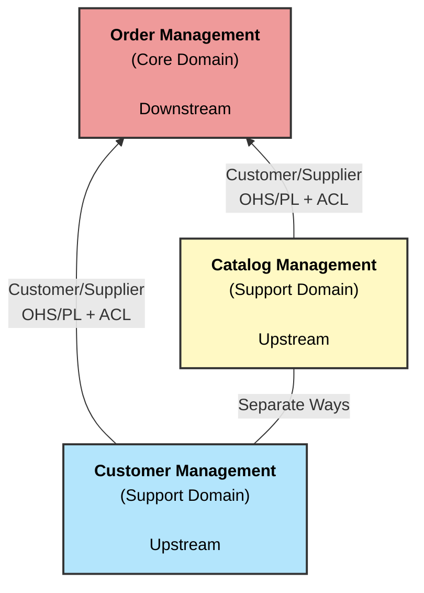
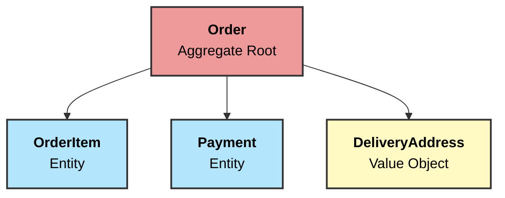
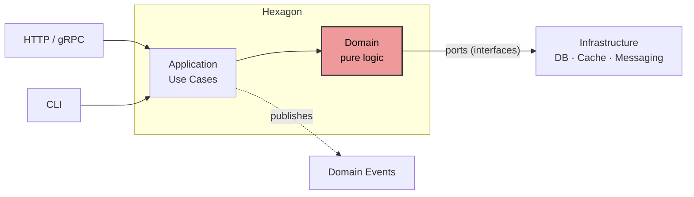

# DDD Rules & Patterns

This document describes the Domain-Driven Design concepts and rules applied in this project. It serves as a reference for both understanding existing code and guiding future implementation.

---

## Strategic DDD

### General Domain
The **General Domain** is the entire universe of activities, concepts, and business rules related to selling products or services. It is the whole from which subdomains emerge.

### Subdomains
A subdomain is a distinct part of the General Domain with its own rules and language:

| Subdomain | Type | Description |
|---|---|---|
| Order Management | **Core Domain** | The heart of the business; highest business value |
| Customer Management | Supporting | Customer profile, history, addresses |
| Catalog Management | Supporting | Products, categories, pricing, stock |
| Notifications | Generic | Email, SMS delivery |
| Coupons | Generic | Discounts and promotions |

**Core Domain** receives the most investment. Supporting Domains can use stubs or simple implementations during early development. Generic Domains can use off-the-shelf solutions.

### Ubiquitous Language
Each Bounded Context has its own **Ubiquitous Language** — the same word can mean different things in different contexts:

| Concept | Order Management | Catalog Management | Customer Management |
|---|---|---|---|
| "Product" | `OrderItem` (snapshot of price at sale time) | `Product` (current catalog entry) | `PurchasedItem` (with warranty, serial number) |
| "Address" | `DeliveryAddress` (immutable snapshot) | — | `Address` (mutable, can have alias) |

The Ubiquitous Language also shapes **method and constructor names** — code should read like domain speech. Factory functions are named `New{DomainConcept}`, and mutating methods express business actions (`ApplyDiscount`, `ConfirmPayment`, `DefineTransactionCode`).

### Context Map — Relationships



#### Relationship Patterns

- **Customer-Supplier (C/S)**: One BC consumes data from another. The supplier doesn't depend on the customer. Order Management consumes from both Catalog and Customer.
- **Open Host Service (OHS)**: The supplier exposes a stable API/contract for consumers.
- **Published Language (PL)**: Events or messages published in a shared format (e.g., integration events).
- **Anti-Corruption Layer (ACL)**: A translation layer on the consumer side that prevents upstream models from leaking into the domain. Order Management translates catalog product data into its own `OrderItem` model.
- **Separate Ways**: Two BCs operate independently with no direct integration. Catalog and Customer have no direct dependency.

---

## Tactical DDD

### Entity

An **Entity** is a domain object with a **unique identity** that persists over time. Its state can change (mutable), but its identity remains constant.

**Rules:**
- Identity equality: two Entities are equal if and only if they share the same ID — regardless of other attributes
- Invariants are enforced in the constructor and in mutating methods
- No public setters — expose behavior through expressive, UL-aligned methods
- `UpdatedAt *time.Time` is `nil` at creation and set on every mutation

**In this project:**
```go
// Construction — validates all invariants
item, err := orderitem.NewOrderItem(productID, productName, unitPrice, quantity)

// Mutation — enforces rules, recalculates derived fields
err = item.ApplyDiscount(10.0)

// Identity equality
item.Equals(other) // compares by ID
```

### Value Object

A **Value Object** is a domain object with **no identity**. It is defined entirely by its attribute values.

**Rules:**
- Immutable — once created, cannot be modified; "changes" produce new instances
- Equality by value: two VOs are equal if all attributes are equal
- No ID field
- All invariants validated in the factory constructor
- Unexported fields (encapsulation enforced by the type system)

**In this project:**
```go
// Immutable construction — validates CEP format, required fields
addr, err := order.NewDeliveryAddress(cep, street, number, complement, district, city, state, country)

// Value equality
addr.Equals(other) // compares all fields
```

### Aggregate

An **Aggregate** is a cluster of Entities and Value Objects treated as a single unit for consistency and transactions. Every Aggregate has one **Aggregate Root**.

**Rules:**
- All external access goes through the Aggregate Root — internal children are never accessed directly from outside
- All state changes within the Aggregate are atomic (transactional)
- Business invariants are enforced by the root
- Cross-aggregate references use IDs only (never object references)
- Keep Aggregates small — one transaction per Aggregate

**Order Aggregate (Core Domain):**



**Business invariants protected by the Order aggregate:**
- Cannot add `OrderItem` to a paid or cancelled order
- `TotalPrice` is always the sum of all `OrderItem.TotalPrice` values, computed by the root
- An order must have at least one item to be valid
- `Order.Status` cannot become `Paid` unless `Payment.Status` is `Authorized`

### Repository

A **Repository** provides an abstraction over persistence for Aggregates. Only Aggregate Roots have repositories — children are persisted through the root.

**Rules:**
- Repository interface is defined in the **domain layer** (a port)
- Implementation lives in the **infrastructure layer** (an adapter)
- Operations: `FindByID`, `Save`, `Delete` (avoid generic CRUD verbiage)
- Returns domain Aggregates, not raw data

```go
// Domain layer defines the port (interface)
type OrderRepository interface {
    FindByID(ctx context.Context, id string) (*Order, error)
    Save(ctx context.Context, order *Order) error
}

// Infrastructure layer implements the adapter
type PostgresOrderRepository struct { ... }
func (r *PostgresOrderRepository) FindByID(...) (*Order, error) { ... }
```

_(Repositories are planned — not yet implemented in this project.)_

### Domain Service

A **Domain Service** encapsulates business logic that doesn't naturally belong to any single Entity or Value Object. It is stateless.

**When to use:** the logic involves multiple Aggregates or requires coordination that doesn't belong to a single root.

**Rules:**
- Stateless — no mutable state
- Named as a verb or business operation (e.g., `PaymentProcessor`, `OrderPricer`)
- Lives in the domain layer — no infrastructure dependencies

_(Domain Services are planned — not yet implemented in this project.)_

### Domain Event

A **Domain Event** represents a significant business fact that has already occurred. It is named in the **past tense**.

**Rules:**
- Named in past tense: `PaymentApproved`, `OrderCancelled`, `CustomerRegistered`
- Immutable — events are facts; they cannot change
- Contains enough data for consumers to react without querying back
- Emitted by Entities/Aggregates; published by the Application layer
- The entity does not know who consumes the event (decoupling)

**Types of events:**
- **Internal events**: consumed within the same Bounded Context (e.g., `OrderItemAdded`)
- **Business events**: cross BC boundaries, usually via messaging (e.g., `PaymentApproved`, `PaymentRefused`)

**In this project:**
```go
// Base event (all domain events embed this)
type Event struct {
    DateOccurred time.Time
}
func (e Event) OccurredAt() time.Time { return e.DateOccurred }

// Domain event interface (for collections/dispatch)
type DomainEvent interface {
    OccurredAt() time.Time
}

// Concrete event
type ApprovedEvent struct {
    Event
    PaymentID       string
    OrderID         string
    Amount          float64
    TransactionCode *string
}
```

### Factory

**Factories** encapsulate complex construction logic. In Go, this is a constructor function whose name follows the **Ubiquitous Language** of the domain — expressing what domain concept is being created.

**Rules:**
- Named `New{DomainConcept}` — clearly expresses what is being constructed at the call site
- All invariants are checked before the object is returned
- Returns the object and an error; never returns an invalid object
- Never use generic names like `Create` or `New` alone — they lose meaning when called across packages

```go
// Entity factory — reads as "new order item" from any call site
func NewOrderItem(productID, productName string, unitPrice float64, quantity int) (*OrderItem, error)

// Entity factory — reads as "new payment" from any call site
func NewPayment(orderID string, amount float64, method Method) (*Payment, error)

// Value Object factory — reads as "new delivery address" from any call site
func NewDeliveryAddress(cep, street, number, complement, district, city, state, country string) (*DeliveryAddress, error)
```

---

## Hexagonal Architecture (Ports & Adapters)

The Hexagonal Architecture isolates the domain from technical concerns. The domain is the center; everything else is an adapter.



**Layers:**

| Layer | Responsibility | Go Package (target) |
|---|---|---|
| Domain | Business rules, Entities, VOs, Aggregates, Domain Events | `domain/` |
| Application | Use cases, command/query handlers, event publishers | `app/` _(planned)_ |
| Infrastructure | DB repos, HTTP handlers, message brokers | `infra/` _(planned)_ |

**Dependency rule:** dependencies point inward — Infrastructure depends on Application, Application depends on Domain. The Domain depends on nothing external.

---

## Rich Domain vs Anemic Domain

**Rich Domain Model** (this project's goal): types contain both data *and* behavior. Business rules live on the Entities and Value Objects.

**Anemic Domain Model** (anti-pattern to avoid): types are just data bags (getters/setters); logic leaks into services, handlers, or controllers.

```go
// ✗ Anemic — logic lives outside the entity
service.RecalculateTotalPrice(item, discount)

// ✓ Rich — behavior lives on the entity, invariants enforced internally
err = item.ApplyDiscount(discount) // recalculates TotalPrice, validates invariant
```

**Primitive Obsession** (related anti-pattern): using primitive types (`string`, `float64`, `int`) for domain concepts that have their own rules. Use Value Objects or typed enums instead.

---

## Error Handling Rules

All domain errors are `*errs.DomainError` with a typed `ErrorCode`.

**Convention:** `ErrorCode` follows `"AGGREGATE.REASON"` — e.g., `"ORDER_ITEM.INVALID_PRODUCT_ID"`, `"DELIVERY_ADDRESS.INVALID_CEP_FORMAT"`.

```go
// Define sentinel errors at package level
var ErrInvalidProductID = errs.New("ORDER_ITEM.INVALID_PRODUCT_ID", "product ID cannot be null or whitespace")

// Collect multiple validation failures
return errors.Join(
    domain.CheckNotNullOrWhiteSpace(productID, ErrInvalidProductID),
    domain.CheckNotZeroOrNegative(unitPrice, ErrInvalidUnitPrice),
)

// errors.Is comparison uses ErrorCode (not pointer equality)
assert.ErrorIs(t, err, ErrInvalidProductID)
```

**Validation guard functions** (`domain/validations.go`):

| Function | Description |
|---|---|
| `CheckNotNullOrWhiteSpace(value, err)` | String must not be blank |
| `CheckNotZeroOrNegative(value, err)` | float64 must be > 0 |
| `CheckMatchRegex(value, regex, err)` | Must match compiled regex |
| `CheckNotNil(value, err)` | Value must not be nil (handles typed nil pointers via reflection) |
| `CheckNil(value, err)` | Value must be nil |

---

## Naming Conventions

| Concept | Convention | Example |
|---|---|---|
| Entity constructors | `New{TypeName}` | `orderitem.NewOrderItem(...)` |
| VO constructors | `New{TypeName}` | `order.NewDeliveryAddress(...)` |
| Domain events | Past-tense noun phrase | `ApprovedEvent`, `RefusedEvent` |
| Status enums | `StatusXxx` | `StatusPending`, `StatusAuthorized` |
| Method/Type enums | `MethodXxx` | `MethodCreditCard`, `MethodPix` |
| ErrorCode | `AGGREGATE.REASON` | `ORDER_ITEM.INVALID_PRODUCT_ID` |
| Guard functions | `CheckXxx` | `CheckNotNullOrWhiteSpace` |
| Mutating methods | Domain action verb | `ApplyDiscount`, `ConfirmPayment`, `DefineTransactionCode` |

---

## Invariants Reference — Order Management

| Business Rule | Enforced In | Error |
|---|---|---|
| ProductID must not be blank | `NewOrderItem` | `ORDER_ITEM.INVALID_PRODUCT_ID` |
| ProductName must not be blank | `NewOrderItem` | `ORDER_ITEM.INVALID_PRODUCT_NAME` |
| UnitPrice must be > 0 | `NewOrderItem`, `UpdateUnitPrice` | `ORDER_ITEM.INVALID_UNIT_PRICE` |
| Quantity must be > 0 | `NewOrderItem`, `AddUnits`, `RemoveUnits` | `ORDER_ITEM.INVALID_QUANTITY` |
| Discount must be >= 0 | `ApplyDiscount` | `ORDER_ITEM.NEGATIVE_DISCOUNT` |
| Discount must be <= UnitPrice | `ApplyDiscount` | `ORDER_ITEM.DISCOUNT_EXCEEDS_PRICE` |
| Quantity cannot reach zero after removal | `RemoveUnits` | `ORDER_ITEM.INSUFFICIENT_QUANTITY` |
| Payment amount must be > 0 | `NewPayment` | `PAYMENT.INVALID_AMOUNT` |
| OrderID must not be blank | `NewPayment` | `PAYMENT.INVALID_ORDER_ID` |
| TransactionCode must be set before confirm/refuse | `ConfirmPayment`, `RefusePayment` | `PAYMENT.TRANSACTION_CODE_NOT_DEFINED` |
| TransactionCode cannot be redefined after completion | `DefineTransactionCode` | `PAYMENT.TRANSACTION_CODE_ALREADY_DEFINED` |
| Payment state must be Pending to confirm/refuse | `ConfirmPayment`, `RefusePayment` | `PAYMENT.NOT_PENDING` |
| CEP must match `\d{5}-\d{3}` | `NewDeliveryAddress` | `DELIVERY_ADDRESS.INVALID_CEP_FORMAT` |
